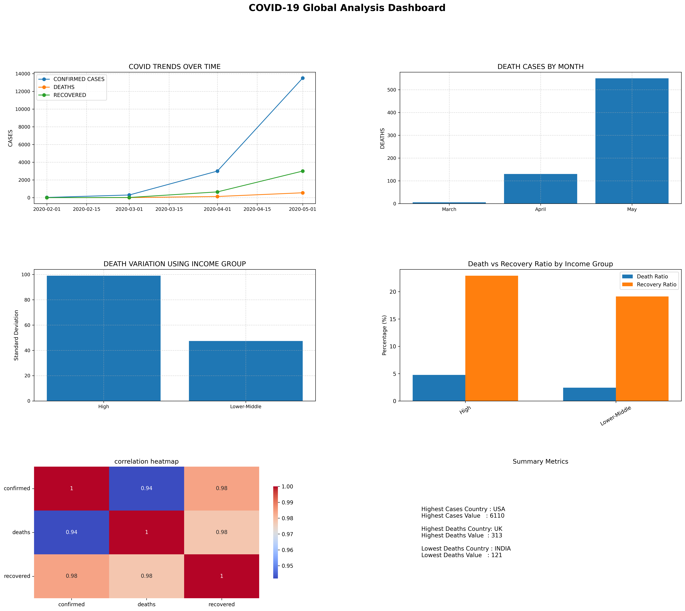

# COVID-19 Global Data Analysis Dashboard

A complete end-to-end data analytics project built using Python, Pandas, NumPy, Matplotlib, and Seaborn to analyze global COVID-19 trends across countries, continents, and income groups.

---

# Project Overview

This project focuses on cleaning, transforming, analyzing, and visualizing COVID-19 data using a modular Python workflow.

The dashboard provides insights into:

* COVID-19 case trends over time
* Death and recovery analysis
* Country-level comparisons
* Income-group-based analysis
* Correlation between confirmed cases, deaths, and recoveries
* Statistical variation across categories

The project was designed to simulate a real-world data analytics workflow using structured data pipelines and dashboard visualizations.

---

# Features

## Data Cleaning

* Removed invalid records
* Standardized country names
* Handled missing values
* Fixed merge inconsistencies
* Extracted month names from dates
* Converted months into ordered categorical data

---

## Data Analysis

### COVID Metrics

* Total confirmed cases
* Total deaths
* Total recoveries
* Average cases per country
* Monthly death trends
* Continent-wise death analysis

### Ratio Analysis

#### Death-to-case ratio

Measures the percentage of confirmed cases that resulted in deaths.

#### Recovery-to-case ratio

Measures the percentage of confirmed cases that recovered.

### Correlation Analysis

Analyzed relationships between:

* Confirmed cases
* Deaths
* Recoveries

### Statistical Analysis

Used standard deviation to analyze death variation across:

* Income groups
* Continents

---

# Dashboard Visualizations

The project dashboard includes:

## 1. COVID Trends Over Time

Line chart showing:

* Confirmed cases
* Deaths
* Recoveries

## 2. Death Cases by Month

Monthly death trend analysis using bar charts.

## 3. Death Variation by Income Group

Standard deviation comparison of deaths across income groups.

## 4. Death vs Recovery Ratio by Income Group

Grouped bar chart comparing:

* Death ratio
* Recovery ratio

## 5. Correlation Heatmap

Heatmap showing correlations between:

* Confirmed cases
* Deaths
* Recoveries

## 6. Summary Metrics

Displays:

* Highest cases country
* Highest deaths country
* Lowest deaths country

---

# Technologies Used

| Technology | Purpose                    |
| ---------- | -------------------------- |
| Python     | Core programming language  |
| Pandas     | Data cleaning and analysis |
| NumPy      | Numerical operations       |
| Matplotlib | Data visualization         |
| Seaborn    | Correlation heatmaps       |

---

# Project Structure

```text
covid_population_data_analysis/
│
├── data/
│   ├── covid_cases.csv
│   ├── country_info.csv
│   └── population.csv
│
├── src/
│   ├── loader.py
│   ├── analysis.py
│   ├── visualization.py
│   └── main.py
│
├── screenshots/
│   └── dashboard.png
│
└── README.md
```

---

# Data Processing Workflow

## 1. Load Data

Loaded datasets using Pandas:

* COVID case data
* Country information
* Population data

## 2. Clean Data

Performed:

* String normalization
* Date formatting
* Missing value handling
* Data filtering

## 3. Merge Datasets

Merged datasets using country as the common key.

## 4. Analyze Data

Performed grouped aggregations and ratio calculations.

## 5. Build Dashboard

Created a multi-panel analytical dashboard using Matplotlib subplots.

---

# Key Insights

* Confirmed cases and recoveries show strong positive correlation.
* Recovery ratios were significantly higher than death ratios.
* COVID cases rapidly increased between March and May.
* Income groups showed different recovery and death patterns.
* High-income countries demonstrated different trends compared to lower-middle-income countries.

---

# Challenges Solved

This project involved solving several real-world data analysis challenges:

* Merge mismatches due to inconsistent country names
* Handling missing values
* GroupBy aggregation errors
* Subplot layout and dashboard overlap issues
* Correlation heatmap rendering problems
* Data standardization across multiple datasets

---

# Skills Demonstrated

* Data Cleaning
* Exploratory Data Analysis
* Data Visualization
* Dashboard Development
* Correlation Analysis
* Pandas GroupBy Operations
* Modular Python Programming
* Debugging Real-world Data Issues

---

# Dashboard Preview

Dashboard image location:

```markdown

```

This dashboard includes:

* COVID trends over time
* Monthly death analysis
* Income-group comparison
* Correlation heatmap
* Summary metrics
* Recovery vs death ratio analysis

---

# Installation

## Clone Repository

```bash
git clone <your-github-repository-link>
```

## Install Dependencies

```bash
pip install pandas numpy matplotlib seaborn
```

---

# Run the Project

```bash
python src/main.py
```

---

# Future Improvements

Potential future upgrades:

* Interactive dashboards using Plotly or Streamlit
* Real-time COVID API integration
* Geographic visualizations
* Forecasting models
* Machine learning-based trend prediction

---

# Author

## Ammara Sajid

Aspiring Data Analyst passionate about:

* Python
* Pandas
* Data Visualization
* Dashboard Design
* Real-world Analytics Projects
